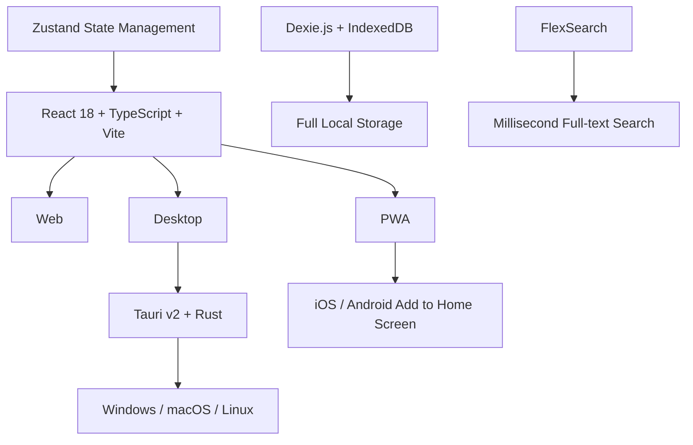

# Kingbird

<p align="center">
  
</p>

> A minimalist, high-performance multi-platform RSS reader. Web + desktop, local storage, zero cloud dependency.

[简体中文](./README.zh.md) | English


---

## Origin of the Name

**Kingbird** — inspired by the **Qingniao (青鸟)** from Chinese mythology.

In legend, the Qingniao served as the messenger of the Queen Mother of the West, flying thousands of miles to deliver news between heaven and earth. "Qing" sounds like "King," and the Kingbird is also a real bird species (Tyrannus), agile and precise — just as an RSS reader flies across the internet to gather stories from everywhere.

---

## Technical Highlights



- 🏠 **Local-first** — All subscriptions, articles, and reading state stored in IndexedDB. Survives browser restarts, exportable anytime.
- 🌐 **Offline-ready** — Service Worker caches app shell. Open and read cached articles without network.
- ⚡ **Ultra-lightweight** — Main bundle ~218KB (gzip), instant first paint.
- 📟 **E-ink mode for Kindle** — Warm paper background, serif fonts, zero CSS animations.
- 🧠 **Bionic reading** — Bold word beginnings guide your eyes to read faster.

---

## Features

### Subscription Management
- 🔗 Manual URL input or smart RSS feed detection from website address
- 📂 Dual organization with folders and tags
- 🔧 Edit subscription title, URL, folder, and tags
- ⏸️ Per-feed control over auto-refresh participation
- ✅ Batch management: select all / toggle refresh for multiple feeds
- 📥 OPML / JSON import and export

### Article Reading
- 📋 Three-column layout: sidebar → article list → reader view
- 👁️ Unread / read tracking, one-click toggle
- ⭐ Starred articles with dedicated filter
- 🔍 Full-text keyword search (FlexSearch local index)
- 🧠 **Bionic reading mode** — bold word beginnings for faster reading

### Reading Experience
- 🌓 Light / Dark / System theme
- 👓 Eye-care mode (warm background)
- 📟 **E-ink mode** — Kindle-style warm paper, serif fonts, zero animations
- 🎨 Custom highlight color — traditional Chinese colors + modern palette + HEX input
- 🔤 Dynamic font size scaling (12px — 24px)
- 🖥️ Monaco Editor-style code blocks (VS Code Dark+ syntax colors + line numbers)

### Refresh Mechanism
- ⚡ HTTP conditional requests (ETag / If-Modified-Since), 304 saves ~99% bandwidth
- 🔄 Per-feed refresh status (pending / success / failure)
- 🔔 Browser push notifications
- ⏱️ Configurable auto-refresh (manual / 15 / 30 / 60 / 180 minutes)

### Data Security
- 🔒 All data stored locally in IndexedDB only
- 🚫 Zero tracking, zero analytics
- 💾 OPML / JSON backup and restore

---

## Tech Stack

| Category | Technology |
|----------|------------|
| Frontend | React 18 + TypeScript + Vite |
| State Management | Zustand |
| Local Storage | Dexie.js (IndexedDB) |
| Styling | Tailwind CSS |
| Icons | Lucide React |
| Search | FlexSearch |
| Code Highlighting | Prism.js |
| XSS Protection | DOMPurify |
| Desktop | Tauri v2 + Rust |

---

## Getting Started

### Build Environment Setup

Kingbird multi-platform build environment: install Node.js + bun first, then Rust (rustup default stable toolchain, target auto-matches host); Windows requires VS 2022 Build Tools with C++ workload, macOS requires Xcode Command Line Tools, Linux requires `build-essential libwebkit2gtk-4.1-dev libgtk-3-dev libayatana-appindicator3-dev librsvg2-dev`. Once ready, `bun install` for dependencies, `bun run build` for Web build, `bun run tauri:build` for desktop installers (Windows→.msi / macOS→.dmg / Linux→.AppImage).

### Web

```bash
bun install
bun run dev      # Dev server → http://localhost:5173
bun run build    # Type check + production build → dist/
```

### Desktop

**Dependencies** (Linux only):

```bash
sudo apt install -y build-essential libwebkit2gtk-4.1-dev \
  libgtk-3-dev libayatana-appindicator3-dev librsvg2-dev
```

**Install Rust** (if not yet installed):

```bash
curl --proto '=https' --tlsv1.2 -sSf https://sh.rustup.rs | sh
source "$HOME/.cargo/env"
```

**Run**:

```bash
bun tauri:dev     # Desktop dev mode
bun tauri:build   # Build installers (.dmg / .msi / .AppImage)
```

---

## Usage Guide

### Add a Feed

1. Click the **+** button in the toolbar (or press `N`)
2. Enter an RSS link or website URL
3. Optionally select a folder and tags
4. Click "Add" to finish

### Organize Feeds

- **Folders**: Select or create folders when editing a subscription; expand/collapse supported
- **Tags**: Right-click a feed → "Manage Tags" → add / remove
- **Batch management**: Click "Batch" → select → toggle refresh for all
- **Per-feed auto-refresh**: Right-click → "Disable Refresh" to exclude from auto-refresh

### Read Articles

- Click an article to enter the reader view
- Toggle **Original / Plain text / Bionic** modes via the top toolbar
- `S` to star, `M` to toggle read, `J` / `K` to navigate articles
- Click ⚙️ for settings → enable eye-care or e-ink mode

### Search

- Click 🔍 or press `/` to open the search panel
- Full-text search across all article titles and content (FlexSearch local index)
- Full CJK (Chinese, Japanese, Korean) support with character-level indexing
- Matching keywords highlighted in search results
- Click a result to navigate directly to the feed and open the article

### Data Backup

Open Settings → Data tab → Export OPML / JSON

---

## Keyboard Shortcuts

| Shortcut | Action |
|----------|--------|
| `J` | Next article |
| `K` | Previous article |
| `S` | Toggle star |
| `M` | Toggle read |
| `N` | Add subscription |
| `R` | Refresh all |
| `V` | Open original link |
| `/` | Search |
| `Esc` | Close panel / reader |

---

## Deployment

### Web

The `dist/` directory contains pure static files, deployable to any static hosting service.

Common platforms:
- **GitHub Pages** — Free, supports custom domains
- **Vercel / Netlify** — Zero-config drag-and-drop deploy
- **Cloudflare Pages** — Global CDN
- **Nginx / Caddy** — Self-hosted

> Example: This project's live instance is deployed on [GitHub Pages](https://github.com/leoyim/kingbird), with a custom domain `ezrss.leoyim.cn` bound via CNAME, DNS CNAME record pointing to `<username>.github.io`.

### Desktop

```bash
bun tauri:build
```

Output:
- macOS → `src-tauri/target/release/bundle/dmg/`
- Windows → `src-tauri/target/release/bundle/msi/`
- Linux → `src-tauri/target/release/bundle/appimage/`

### PWA

The project includes `manifest.json` and a Service Worker. After deployment, users can "Add to Home Screen" via browser to use it as a standalone app. The toolbar automatically shows an install button when available.

---

## License

MIT License
