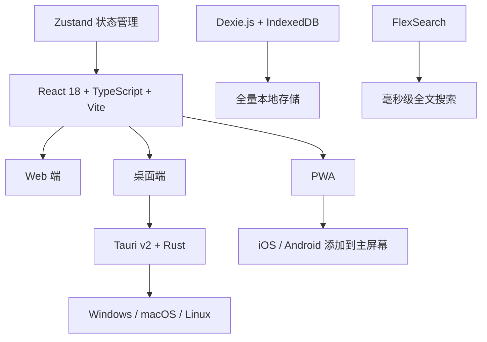

# Kingbird

<p align="center">
  
</p>

> 极简、高性能的多平台 RSS 阅读器。Web + 桌面双端，数据本地存储，零云端依赖。

简体中文 | [English](./README.md)


---

## 名字由来

**Kingbird** — 取自中国神话中的**青鸟（Qingniao）**。

青鸟是西王母的信使，振翅千里，为人间传递消息。Qing → King 同音，Kingbird 也是自然界真实存在的鸟类（王霸鹟），敏捷精准，恰如 RSS 阅读器替你飞越山海、收集四方见闻。

---

## 技术亮点



- 🏠 **本地优先** — 所有订阅、文章、阅读记录存在 IndexedDB，关闭浏览器不会丢，随时可导出备份
- 🌐 **离线可用** — Service Worker 缓存壳资源，无网络也能打开应用、阅读已缓存文章
- ⚡ **极致轻量** — 主 Bundle ~218KB（gzip），首屏秒开
- 📟 **墨水屏专为 Kindle 设计** — 暖黄纸张底色、衬线字体、零 CSS 动画
- 🧠 **仿生阅读** — 单词首部加粗，引导眼睛快速扫读

---

## 特性

### 订阅管理
- 🔗 手动输入 URL 或网站地址智能检测 RSS 源
- 📂 文件夹 / 标签双重组织订阅源
- 🔧 编辑订阅标题、URL、文件夹、标签
- ⏸️ 每源独立控制是否参与定时刷新
- ✅ 批量管理：全选 / 一键开启或取消多个源的刷新
- 📥 OPML / JSON 导入导出

### 文章阅读
- 📋 三栏布局：侧边栏 → 文章列表 → 阅读视图
- 👁️ 未读 / 已读追踪，一键标记
- ⭐ 文章收藏，独立收藏筛选
- 🔍 全文关键词搜索（FlexSearch 本地索引）
- 🧠 **仿生阅读模式** — 单词首部加粗，提升阅读速度

### 阅读体验
- 🌓 浅色 / 深色 / 跟随系统三种主题
- 👓 护眼模式（暖色背景）
- 📟 **墨水屏模式** — Kindle 风格，暖黄纸张、衬线字体、零动画
- 🎨 高亮色自定义 — 传统中国色 + 现代流行色 + HEX 输入
- 🔤 阅读字体大小动态缩放 (12px — 24px)
- 🖥️ 代码块 Monaco Editor 风格（VS Code Dark+ 语法配色 + 行号）

### 刷新机制
- ⚡ HTTP 条件请求（ETag / If-Modified-Since），304 节省 ~99% 流量
- 🔄 每源刷新状态实时显示（pending / success / failure）
- 🔔 浏览器推送通知
- ⏱️ 自动刷新可配置（手动 / 15 / 30 / 60 / 180 分钟）

### 数据安全
- 🔒 所有数据仅存于本地 IndexedDB
- 🚫 零追踪、零分析
- 💾 OPML / JSON 备份还原

---

## 技术栈

| 类别 | 技术 |
|------|------|
| 前端 | React 18 + TypeScript + Vite |
| 状态管理 | Zustand |
| 本地存储 | Dexie.js (IndexedDB) |
| 样式 | Tailwind CSS |
| 图标 | Lucide React |
| 搜索 | FlexSearch |
| 代码高亮 | Prism.js |
| XSS 防护 | DOMPurify |
| 桌面端 | Tauri v2 + Rust |

---

## 快速开始

### 环境搭建提示词

Kingbird 多平台编译环境：先装 Node.js + bun，再装 Rust（rustup 默认 stable 工具链，目标自动匹配本机）；Windows 需 VS 2022 Build Tools 的 C++ 工作负载，macOS 需 Xcode Command Line Tools，Linux 需 `build-essential libwebkit2gtk-4.1-dev libgtk-3-dev libayatana-appindicator3-dev librsvg2-dev`。

### Web 端

```bash
bun install
bun run dev      # 启动开发服务器 → http://localhost:5173
bun run build    # 类型检查 + 生产打包 → dist/
```

### 桌面端

**依赖**（仅 Linux 需要手动安装）：

```bash
sudo apt install -y build-essential libwebkit2gtk-4.1-dev \
  libgtk-3-dev libayatana-appindicator3-dev librsvg2-dev
```

**安装 Rust**（如果尚未安装）：

```bash
curl --proto '=https' --tlsv1.2 -sSf https://sh.rustup.rs | sh
source "$HOME/.cargo/env"
```

**启动**：

```bash
bun tauri:dev     # 桌面开发模式
bun tauri:build   # 构建安装包（.dmg / .msi / .AppImage）
```

---

## 使用指南

### 添加订阅源

1. 点击工具栏 **+** 按钮（或按 `N`）
2. 输入 RSS 链接或网站地址
3. 可选择文件夹和标签
4. 点击"添加"完成

### 组织订阅源

- **文件夹**：编辑订阅时可选择 / 新建文件夹，支持展开折叠
- **标签**：右键订阅源 → "管理标签" → 添加 / 移除
- **批量管理**：点击 "批量" → 勾选 → 一键开启 / 取消刷新
- **每源定时刷新**：右键 → "取消刷新" 可将该源从自动刷新中排除

### 阅读文章

- 点击文章进入阅读视图
- 顶部工具栏切换 **原文 / 纯文本 / 仿生** 模式
- `S` 收藏，`M` 切换已读，`J` / `K` 切换文章
- 点击 ⚙️ 进入设置 → 开启护眼或墨水屏模式

### 搜索

- 点击 🔍 或按 `/` 打开搜索面板
- 全文搜索所有文章标题和内容（FlexSearch 本地索引）
- 完整支持中日韩（CJK）字符级索引
- 搜索结果中匹配关键词高亮显示
- 点击结果直接跳转到对应订阅源并打开文章

### 数据备份

打开设置 → 数据标签 → 导出 OPML / JSON

---

## 键盘快捷键

| 快捷键 | 功能 |
|--------|------|
| `J` | 下一篇 |
| `K` | 上一篇 |
| `S` | 切换收藏 |
| `M` | 切换已读 |
| `N` | 添加订阅 |
| `R` | 刷新全部 |
| `V` | 打开原文链接 |
| `/` | 搜索 |
| `Esc` | 关闭面板 / 关闭阅读 |

---

## 部署

### Web 端

`dist/` 目录为纯静态文件，可部署到任意静态托管服务。

常用平台：
- **GitHub Pages** — 免费，支持自定义域名
- **Vercel / Netlify** — 零配置拖拽部署
- **Cloudflare Pages** — 全球 CDN
- **Nginx / Caddy** — 自托管

> 示例：本项目的线上实例部署在 [GitHub Pages](https://github.com/leoyim/kingbird)，通过 CNAME 绑定自定义域名 `ezrss.leoyim.cn`，DNS CNAME 记录指向 `<username>.github.io`。

### 桌面端

```bash
bun tauri:build
```

产物：
- macOS → `src-tauri/target/release/bundle/dmg/`
- Windows → `src-tauri/target/release/bundle/msi/`
- Linux → `src-tauri/target/release/bundle/appimage/`

### PWA

项目包含 `manifest.json` 和 Service Worker，部署后可通过浏览器"添加到主屏幕"作为独立应用使用。工具栏自动显示安装按钮。

---

## 许可

MIT License
